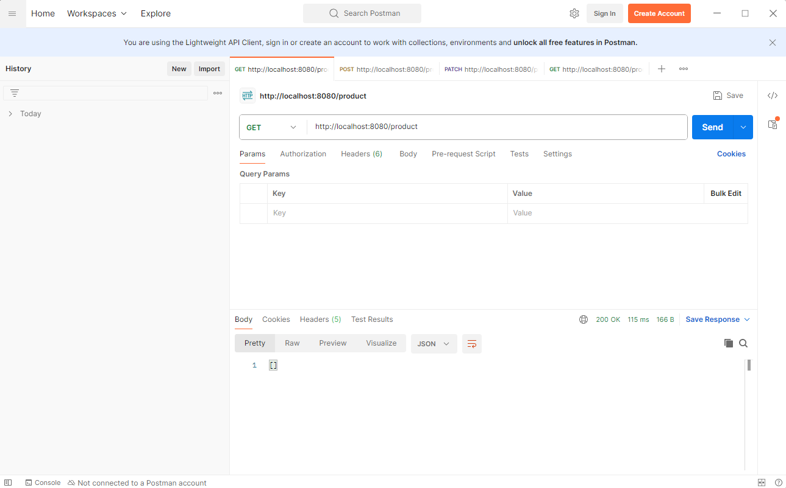
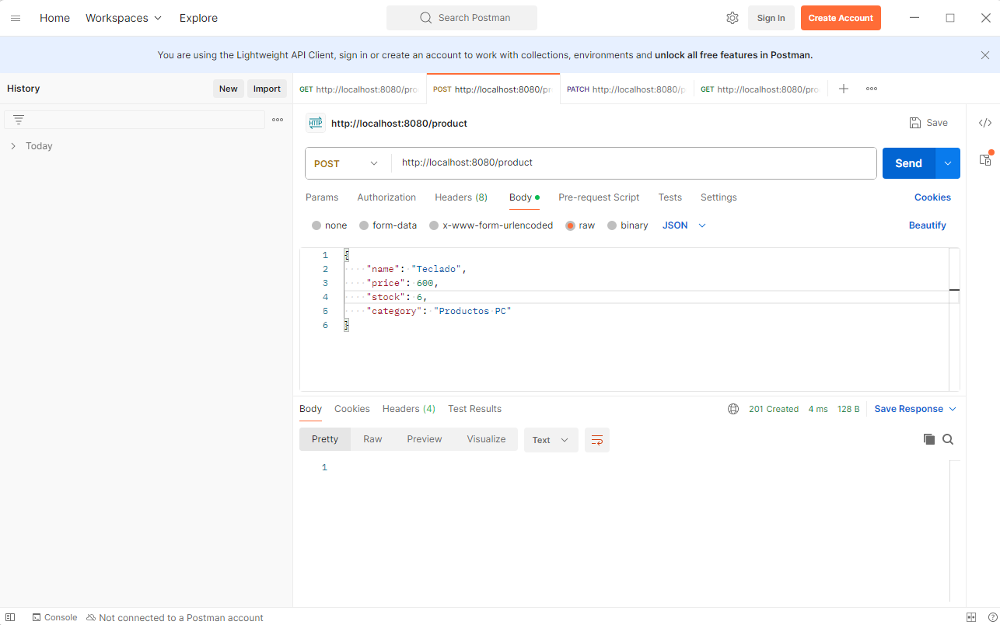
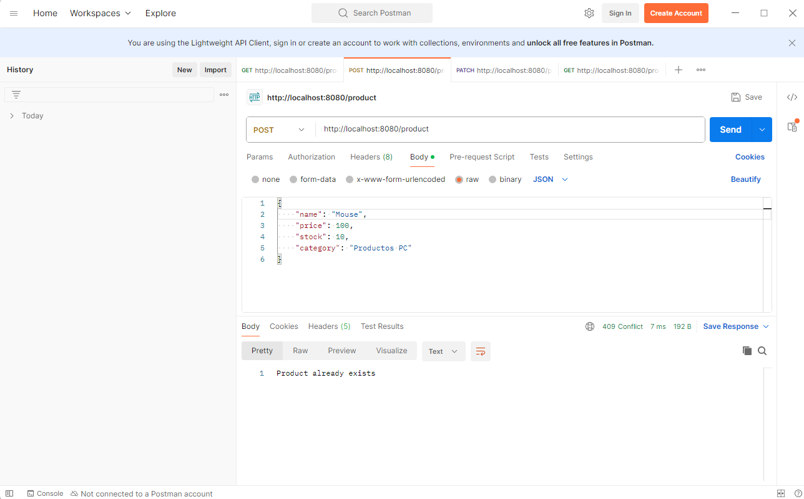
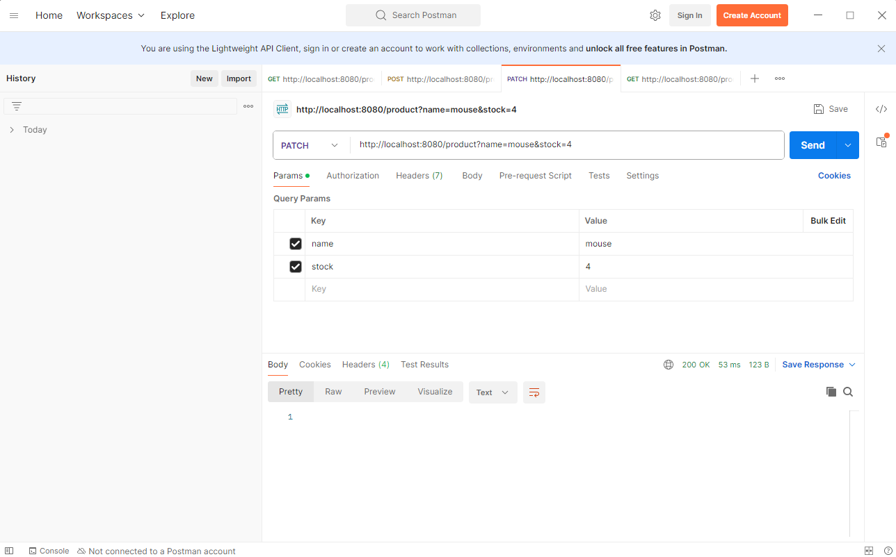
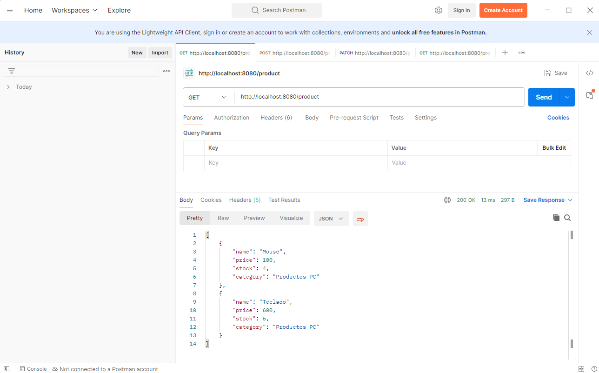
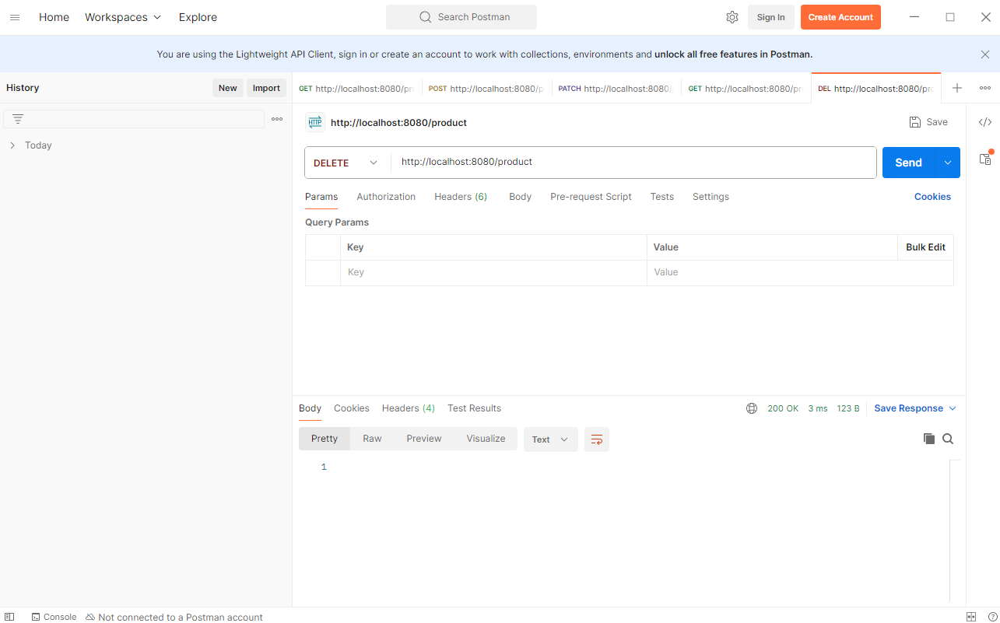
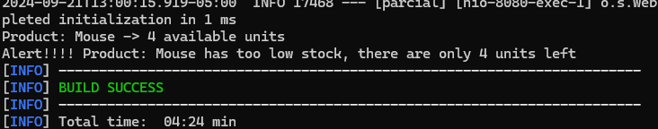

# Proyecto Parcial 1 - CVDS

Este proyecto fue desarrollado para el Parcial 1 de la materia Construcción de Software (CVDS) por Tomás Felipe Panqueva.

## Descripción

El proyecto consiste en una aplicación Spring Boot que gestiona productos y sus niveles de stock. Incluye agentes que monitorean y registran actualizaciones de productos.

## Tecnologías Utilizadas

- Java
- Spring Boot
- Maven

## Estructura del Proyecto

- `src/main/java/com/tomas/cvds/parcial/agents`: Contiene las clases de los agentes (`AgentManager`, `LogAgent`, `StockAgent`).
- `src/main/java/com/tomas/cvds/parcial/database`: Contiene la base de datos en memoria para los productos.
- `src/main/java/com/tomas/cvds/parcial/models`: Contiene los modelos de datos utilizados en la aplicación.
- `src/main/java/com/tomas/cvds/parcial/services`: Contiene los servicios de la aplicación (`ProductService`).
- `src/main/java/com/tomas/cvds/parcial/controllers`: Contiene los controladores de la aplicación (`ProductController`).
- `src/main/java/com/tomas/cvds/parcial/exceptions`: Contiene las excepciones personalizadas de la aplicación.

## Patrones de diseño

En este proyecto utilizamos dos patrones de diseño:

- `Observer`: Utilizado para notificar a los agentes de los cambios en los productos. Esto debido a que cada vez que se actualiza un producto, los agentes deben registrar la actualización.
- `Singleton`: Utilizado para garantizar que solo exista una instancia de la base de datos en memoria. Esto para evitar que la inyeccion de dependencia genere multiples instancias de la base de datos.

## Ejecución de Pruebas

Para ejecutar las pruebas y generar un informe de cobertura con JaCoCo, sigue estos pasos:

1. Ejecuta las pruebas:
    ```sh
    mvn clean test
    ```

2. Genera el informe de cobertura:
    ```sh
    mvn jacoco:report
    ```

3. Revisa el informe en `target/site/jacoco/index.html`.

## Ejecucion del proyecto (desarrollo)

Para ejecutar el proyecto en modo de desarrollo, sigue estos pasos:

1. Ejecuta: ```mvn spring-boot:run```

## Ejemplos:

### Obtener productos (Lista vacia)


### Creacion de productos



### Error al crear un producto que ya existe


### Actualizacion del stock de un producto


### Lista probando el stock


### Eliminacion de todos los productos


### Funcionamiento de los agentes


## Autor

Tomás Felipe Panqueva